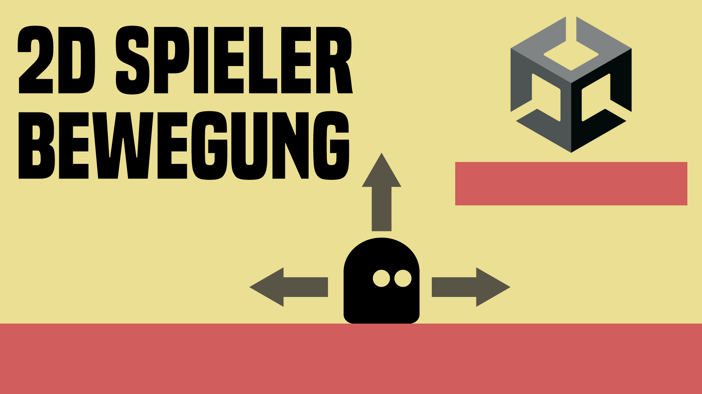

# 2D Spieler Bewegung

in diesem Video lernst du, wie du deinen 2D Spieler nach links und rechts bewegen - und nach oben springen kannst.

- [🎬 YT Tutorial](https://youtu.be/iQPyiVYf5Os)
- [💬 Joint unserem Discord Server](https://discord.gg/cY5RW7D95u)
- [👍 Abonniert um keine Videos zu verpassen](https://www.youtube.com/@prezipgames)

## Viel Spaß beim Entwickeln!
